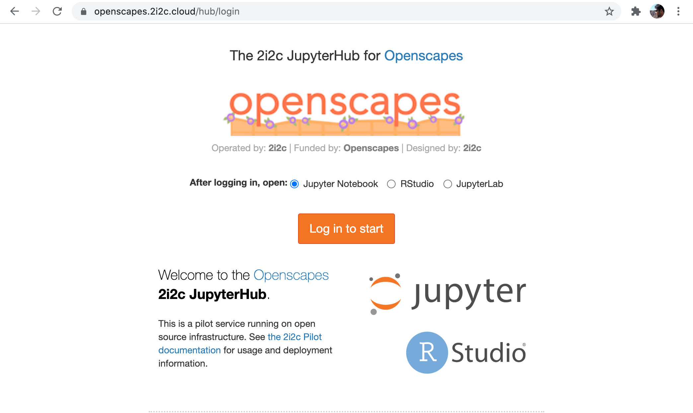
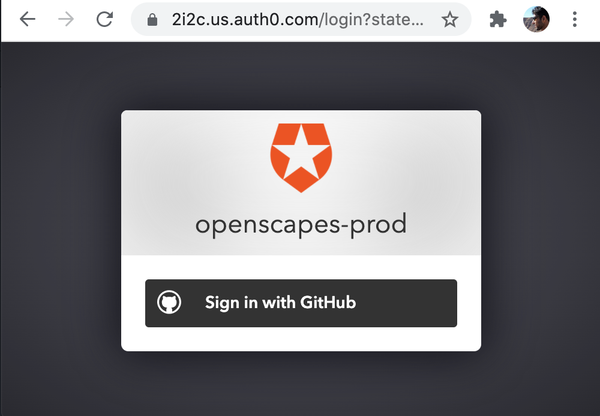
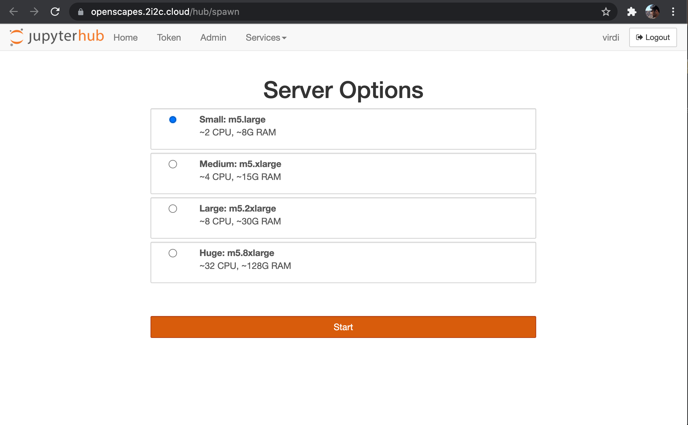
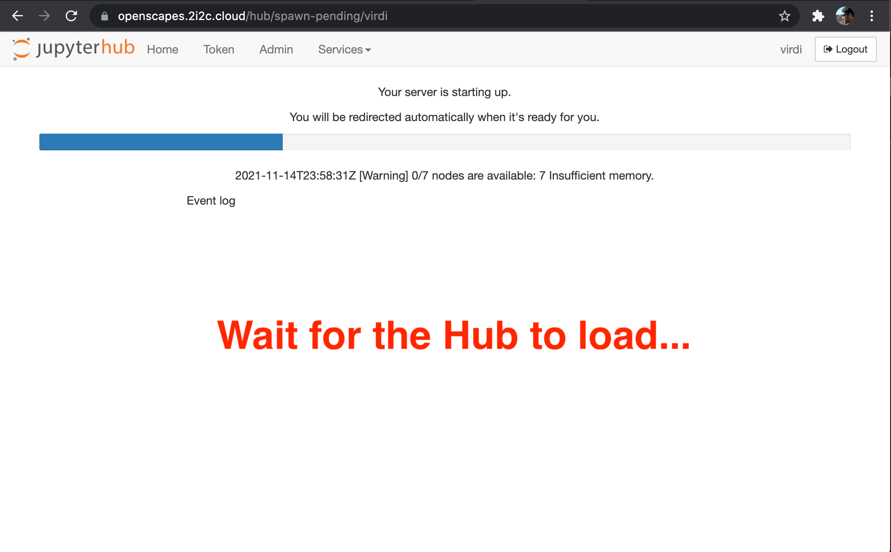
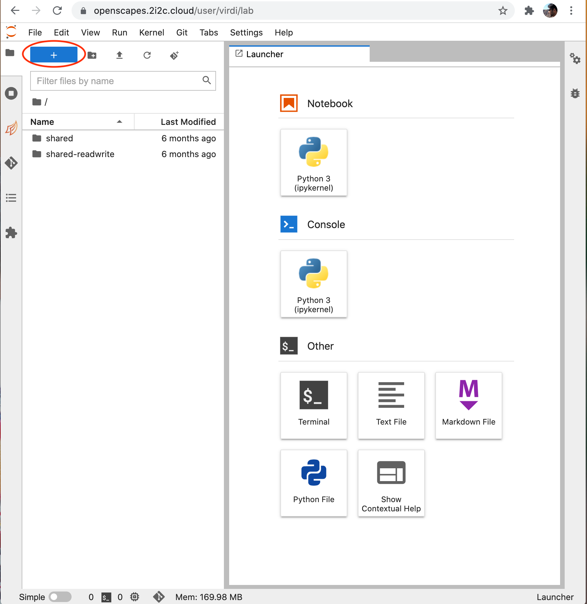

This tutorial will help you set up your JupyterHub (or Hub) with tutorials and other materials from our Cloud Workshop folder..

## Step 1. Login to the Hub

Please go to the [Jupyter Hub](https://openscapes.2i2c.cloud/) and Log in with your GitHub Account, and select "Small".

Alternatively, you can also click this badge to launch the Hub:

{fig-align="center"}

{width="500"}

{width="500"}

{width="500"}

{width="500"}

> **Note:** It takes a few minutes for the Hub to load. Please be patient!

While the Hub loads, we'll:

-   Discuss cloud environments
-   See how my Desktop is setup
-   Discuss python and conda environments

Then, when the Hub is loaded, we'll get oriented in the Hub.

## Discussion: Cloud environment

A brief overview. See [NASA Openscapes Cloud Environment](https://nasa-openscapes.github.io/2021-Cloud-Hackathon/clinic/jupyterhub.html) in the 2021-Cloud-Hackathon book for more detail.

#### Cloud infrastructure

-   Cloud: AWS [`us-west-2`](https://goo.gl/maps/BYqGYxahpwJgzKwR8)
    -   Data: AWS S3 (cloud) and [NASA DAAC](https://earthdata.nasa.gov/eosdis/daacs) data centers (on-prem).
    -   Cloud compute environment:  [2i2c Jupyterhub deployment](https://docs.2i2c.org/en/latest/)
        -   IDE: [**JupyterLab**](https://jupyterlab.readthedocs.io/en/stable/getting_started/overview.html)

## Discussion: My desktop setup

I'll screenshare to show and/or talk through how I have oriented the following software we're using:

-   [Workshop Book](https://nasa-openscapes.github.io/2021-Cloud-Workshop-AGU/) (my teaching notes, your reference material)
-   Zoom Chat

## Discussion: Python and Conda environments

[**Why Python?**](https://foundations.projectpythia.org/foundations/why-python.html)


**Default Python Environment:**

We've set up the Python environment with conda.

::: {.callout-note collapse="true"}
### Conda environment

``` yaml
name: openscapes
channels:
  - conda-forge
dependencies:
  - python=3.9
  - pangeo-notebook
  - awscli~=1.20
  - boto3~=1.19
  - gdal~=3.3
  - rioxarray~=0.8
  - xarray~=0.19
  - h5netcdf~=0.11
  - netcdf4~=1.5
  - h5py~=2.10
  - geoviews~=1.9
  - matplotlib-base~=3.4
  - hvplot~=0.7
  - pyproj~=3.2
  - bqplot~=0.12
  - geopandas~=0.10
  - zarr~=2.10
  - cartopy~=0.20
  - shapely==1.7.1
  - pyresample~=1.22
  - joblib~=1.1
  - pystac-client~=0.3
  - s3fs~=2021.7
  - ipyleaflet~=0.14
  - sidecar~=0.5
  - jupyterlab-geojson~=3.1
  - jupyterlab-git
  - jupyter-resource-usage
  - ipympl~=0.6
  - conda-lock~=0.12
  - pooch~=1.5
  - pip
  - pip:
    - tqdm
    - harmony-py
    - earthdata
    - zarr-eosdis-store
```
:::

### Bash terminal and installed software

Libraries that are available from the terminal

-   gdal 3.3 commands ( gdalinfo, gdaltransform...)
-   hdf5 commands ( h5dump, h5ls..)
-   netcdf4 commands (ncdump, ncinfo ...)
-   jq (parsing json files or streams from curl)
-   curl (fetch resources from the web)
-   awscli (AWS API client, to interact with AWS cloud services)
-   vim (editor)
-   tree ( directory tree)
-   more ...

### Updating the environment

Scientific Python is a vast space and we only included libraries that are needed in our tutorials. Our default environment can be updated to include any Python library that's available on pip or conda.

The project used to create our default environment is called **corn** (as it can include many Python kernels).

If we want to update a library or install a whole new environment we need to open an issue on this repository. 

### [corn 🌽](https://github.com/NASA-Openscapes/corn)

## Step 2. JupyterHub orientation

Now that the Hub is loaded, let's get oriented.

[{width="500"}](img/JupyterHub-View.png)

### First impressions

-   Launcher & the big blue button
-   "home directory"

## Step 3. Navigate to the Workshop folder

The workshop folder `2021-Cloud-Workshop-AGU` is in the shared folder on JupyterHub. 

## Jupyter notebooks

Let's get oriented to Jupyter notebooks, which we'll use in all the tutorials.

## How do I end my session?

*(Also see [How do I end my Openscapes session? Will I lose all of my work?](https://nasa-openscapes.github.io/2021-Cloud-Hackathon/clinic/jupyterhub.html#how-do-i-end-my-openscapes-session))*

When you are finished working for the day it is important to explicitly log out of your Openscapes session. The reason for this is it will save us a bit of money! When you keep a session active it uses up AWS resources and keeps a series of virtual machines deployed.

Stopping the server happens automatically when you log out, so navigate to "File -> Log Out" and just click "Log Out"!

!!! NOTE "logging out" - Logging out will **NOT** cause any of your work to be lost or deleted. It simply shuts down some resources. It would be equivalent to turning off your desktop computer at the end of the day.


