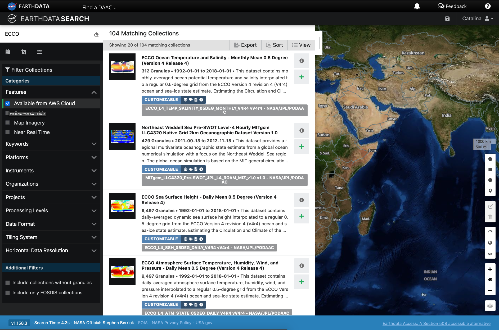

This tutorial guides you through using [Earthdata Search](https://search.earthdata.nasa.gov/) for NASA Earth observations search and discovery, and how to connect serach output (e.g. download or access links) to a programmatic workflow in the cloud. 

### Step 1. Go to Earthdata Search and Login

Go to Earthdata Search https://search.earthdata.nasa.gov/ and use your Earthdata login credentials to log in. If you do not have an Earthdata account, please see the Workshop Prerequisites page for guidance.

### Step 2. Search for dataset of interest

Use the search box in the upper left to type key words. In this example we are interested in the ECCO dataset, hosted by the PO.DAAC. This dataset is available from the NASA Earthdata Cloud archive hosted in AWS cloud. 

Click on the "Available from AWS Cloud" filter option.

