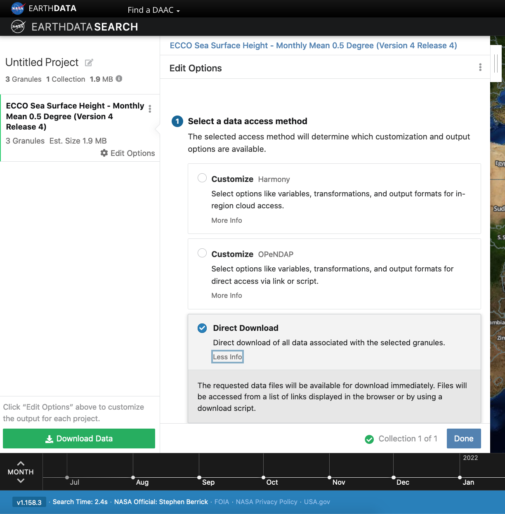

This tutorial guides you through using [Earthdata Search](https://search.earthdata.nasa.gov/) for NASA Earth observations search and discovery, and how to connect serach output (e.g. download or access links) to a programmatic workflow in the cloud. 

### Step 1. Go to Earthdata Search and Login

Go to Earthdata Search https://search.earthdata.nasa.gov/ and use your Earthdata login credentials to log in. If you do not have an Earthdata account, please see the Workshop Prerequisites page for guidance.

### Step 2. Search for dataset of interest

Use the search box in the upper left to type key words. In this example we are interested in the ECCO dataset, hosted by the PO.DAAC. This dataset is available from the NASA Earthdata Cloud archive hosted in AWS cloud. 

Click on the "Available from AWS Cloud" filter option on the left. Here, 104 matching collections were found with the basic `ECCO` search.

Let's refine our search further. Let's search for `ECCO monthly SSH` in the search box (which will produce 37 matching collections), and for the **time period** for year 2015. The latter can be done using the 'calendar' icon on the left under the search box. 

Scroll down the list of returned matches until we see the dataset of interest, here *ECCO Sea Surface Height - Monthly Mean 0.5 Degree (Version 4 Release 4)*.

We can click on the (i) icon for the dataset to read more details, including the **dataset shortname** (helpful for programmatic workflows) just below the dataset name; here `ECCO_L4_SSH_05DEG_MONTHLY_V4R4`.

### Step 3. Explore the dataset details, including Cloud Access information

Scrolling down the info page for the dataset, we will see Cloud Access information, such as:

- whether the dataset is available in the cloud, 
- the cloud region (all NASA Earthdata Cloud data is/will be in `us-west-2` region) and 
- the S3 storage 'bucket' and 'object prefix' where this data is located, and link to getting AWS credentials for data access. We will cover the latter in the Direct Access Tutorial. 

Pro Tip: Clicking on "For Developers" to exapnd will provide programmatic endpoints such as those for the CMR API, and more. CMR API and CMR STAC API tutorials can be found on the [2021 Cloud Hackathon website](https://nasa-openscapes.github.io/2021-Cloud-Hackathon/tutorials/).

For now, let's say we are intersted in getting download or access links for specific data within this collection.

At the top of the dataset info section, click on Search Results, which will take us back to the list of datasets matching out search parameters. Clicking on the dataset (here again it's the same *ECCO Sea Surface Height - Monthly Mean 0.5 Degree (Version 4 Release 4)*) we now see a list of files (granules) that are part of the dataset (collection). 

### Step 4. Customize the download or data access

Click on the + symbol to add a few files to our project. Here we added the first 3 listed for 2015. Then click on the green button towards the bottom "Download". This will take us to anther page with options to customize our download or access links.

#### Entire file content

Let's stay we are interested in the entire file content, so we select the "Direct Download" option:

Clicking the green Download Data button again, will take us to the final page for instructions to download or links for data access in the cloud. You should see thre3 tabs: `Download`, `AWS S3 Access`, `Download Script`:

#### Subset or transform before download or access

*add more here: Harmony, Opendap*

### Step 5. Integrate file links into programmatic workflow, locally or in the AWS cloud. 

*more here .... talk about direct access*

